# Site Index Models

## Site index models included in the package

### `si_alemdag1991()`

- Function reference:
  [`si_alemdag1991()`](https://ptompalski.github.io/CanadaForestAllometry/reference/si_alemdag1991.md)
- Description: Alemdag (1991) national (Canada-wide) modified
  Chapman-Richards site-index and height-growth model for white spruce
  in natural stands
- Age type: Breast-height age
- Coverage: Canada (all provinces/territories)
- Species coverage: PICE.GLA

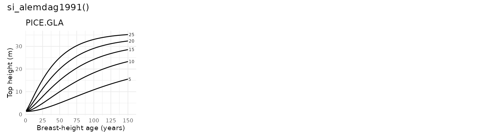

### `si_augerward2021()`

- Function reference:
  [`si_augerward2021()`](https://ptompalski.github.io/CanadaForestAllometry/reference/si_augerward2021.md)
- Description: Auger and Ward (2021) Quebec plantation site-index model
- Age type: Total age
- Coverage: QC
- Species coverage: PICE.MAR, PINU.BAN

### `si_batho2014()`

- Function reference:
  [`si_batho2014()`](https://ptompalski.github.io/CanadaForestAllometry/reference/si_batho2014.md)
- Description: Batho and Garcia (2014) polymorphic Bertalanffy-Richards
  height-age (site index) model for lodgepole pine in the Sub-Boreal
  Spruce zone of British Columbia
- Age type: Breast-height age
- Coverage: BC
- Species coverage: PINU.CON

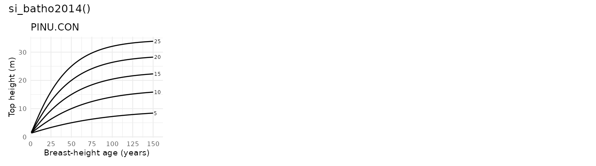

### `si_brisco2002()`

- Function reference:
  [`si_brisco2002()`](https://ptompalski.github.io/CanadaForestAllometry/reference/si_brisco2002.md)
- Description: Brisco, Klinka and Nigh (2002) Chapman-Richards
  height-age (site index) model for western larch in British Columbia
- Age type: Breast-height age
- Coverage: BC
- Species coverage: LARI.OCC

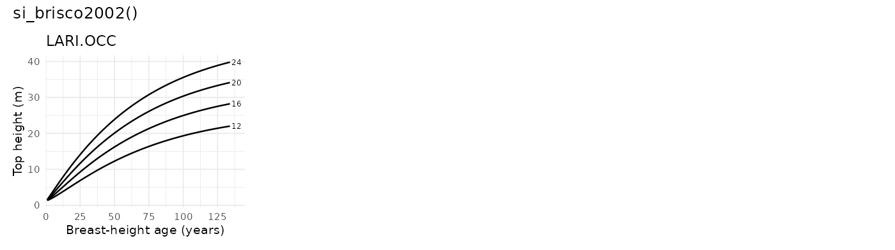

### `si_buckman2006()`

- Function reference:
  [`si_buckman2006()`](https://ptompalski.github.io/CanadaForestAllometry/reference/si_buckman2006.md)
- Description: Buckman et al. (2006) piecewise red pine site-index model
- Age type: Total age
- Coverage: ON
- Species coverage: PINU.RES

### `si_carmean1989()`

- Function reference:
  [`si_carmean1989()`](https://ptompalski.github.io/CanadaForestAllometry/reference/si_carmean1989.md)
- Description: Carmean et al. (1989) eastern species site-index model
  set
- Age type: Total age
- Coverage: NB, NL, NS, ON, PE, QC
- Species coverage: ACER.SAH, BETU.ALL, CHAM.THY, FAGU.GRA, FRAX.AME,
  FRAX.NIG, PRUN.SER, QUER.RUB, TILI.AME, TSUG.CAN, ULMU.AME

### `si_carmean1996()`

- Function reference:
  [`si_carmean1996()`](https://ptompalski.github.io/CanadaForestAllometry/reference/si_carmean1996.md)
- Description: Carmean (1996) northwest Ontario site-index model set
- Age type: Breast-height age
- Coverage: ON
- Species coverage: ABIE.BAL, BETU.PAP, LARI.LAR, PICE.GLA, PICE.MAR,
  PINU.BAN, POPU.TRE

### `si_carmean2001()`

- Function reference:
  [`si_carmean2001()`](https://ptompalski.github.io/CanadaForestAllometry/reference/si_carmean2001.md)
- Description: Carmean, Niznowski and Hazenberg (2001) polymorphic
  (Newnham) site-index model for jack pine in northern Ontario
- Age type: Breast-height age
- Coverage: ON
- Species coverage: PINU.BAN

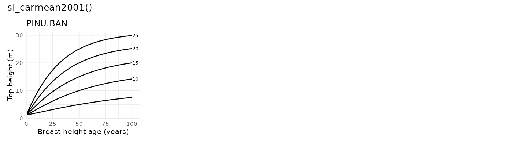

### `si_carmean2006()`

- Function reference:
  [`si_carmean2006()`](https://ptompalski.github.io/CanadaForestAllometry/reference/si_carmean2006.md)
- Description: Carmean, Hazenberg and Deschamps (2006) polymorphic
  (Newnham) site-index model for black spruce and trembling aspen in
  northwest Ontario
- Age type: Breast-height age
- Coverage: ON
- Species coverage: PICE.MAR, POPU.TRE

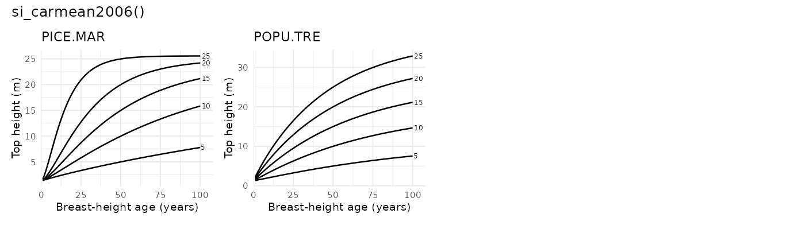

### `si_carmeanhahn1981()`

- Function reference:
  [`si_carmeanhahn1981()`](https://ptompalski.github.io/CanadaForestAllometry/reference/si_carmeanhahn1981.md)
- Description: Lake States site-index model for balsam fir and white
  spruce
- Age type: Total age
- Coverage: ON
- Species coverage: ABIE.BAL, PICE.GLA

### `si_chenklinka2000()`

- Function reference:
  [`si_chenklinka2000()`](https://ptompalski.github.io/CanadaForestAllometry/reference/si_chenklinka2000.md)
- Description: Chen and Klinka (2000) conditioned Chapman-Richards
  height-age (site index) model for subalpine fir, Engelmann spruce, and
  lodgepole pine in the ESSF zone of British Columbia
- Age type: Breast-height age
- Coverage: BC
- Species coverage: ABIE.LAS, PICE.ENG, PINU.CON

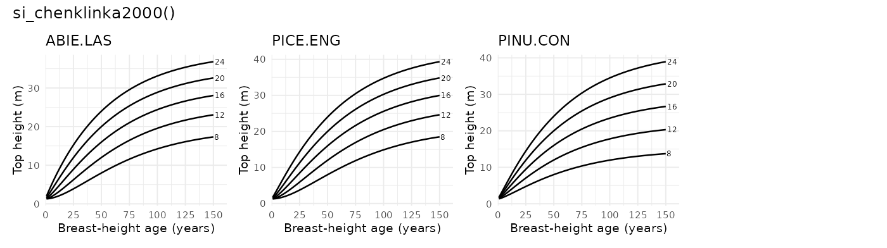

### `si_cieszewski1993()`

- Function reference:
  [`si_cieszewski1993()`](https://ptompalski.github.io/CanadaForestAllometry/reference/si_cieszewski1993.md)
- Description: Cieszewski, Bella and Yeung (1993) preliminary
  variable-age site-index model for eleven Saskatchewan species
- Age type: Breast-height age
- Coverage: SK
- Species coverage: ABIE.BAL, ACER.NEG, BETU.PAP, LARI.LAR, PICE.GLA,
  PICE.MAR, PINU.BAN, PINU.CON, POPU.BAL, POPU.TRE, ULMU.AME

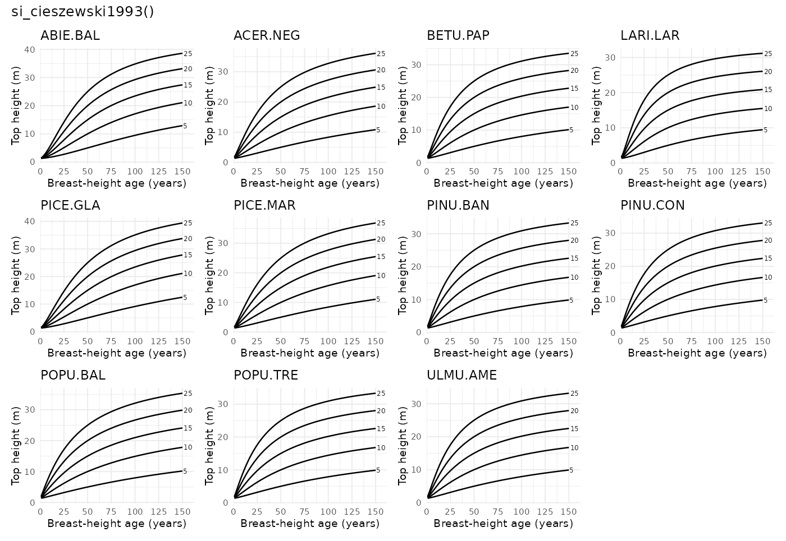

### `si_cieszewskibella1991()`

- Function reference:
  [`si_cieszewskibella1991()`](https://ptompalski.github.io/CanadaForestAllometry/reference/si_cieszewskibella1991.md)
- Description: Alberta polymorphic variable-age site-index model for
  four major tree species
- Age type: Breast-height age
- Coverage: AB
- Species coverage: PICE.GLA, PICE.MAR, PINU.CON, POPU.TRE

### `si_goelz1992()`

- Function reference:
  [`si_goelz1992()`](https://ptompalski.github.io/CanadaForestAllometry/reference/si_goelz1992.md)
- Description: Goelz and Burk (1992) base-age invariant Chapman-Richards
  site-index model for jack pine in north central Ontario
- Age type: Breast-height age
- Coverage: ON
- Species coverage: PINU.BAN

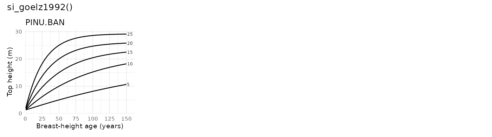

### `si_goudie1984()`

- Function reference:
  [`si_goudie1984()`](https://ptompalski.github.io/CanadaForestAllometry/reference/si_goudie1984.md)
- Description: Goudie (1984) logistic height-age (site-index) model for
  lodgepole pine and white spruce in British Columbia (SAS-reference
  implementation; pine dry-site coefficients)
- Age type: Breast-height age
- Coverage: BC
- Species coverage: PICE.GLA, PINU.CON

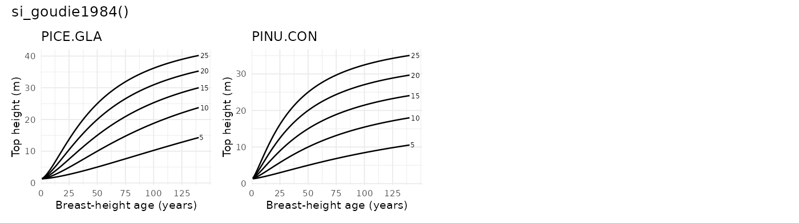

### `si_huang1994()`

- Function reference:
  [`si_huang1994()`](https://ptompalski.github.io/CanadaForestAllometry/reference/si_huang1994.md)
- Description: Huang et al. (1994) Alberta polymorphic site-index model
  set
- Age type: Breast-height age
- Coverage: AB
- Species coverage: ABIE.BAL, PICE.GLA, PICE.MAR, PINU.BAN, PINU.CON,
  POPU.BAL, POPU.TRE, PSEU.MEN

### `si_huang2009()`

- Function reference:
  [`si_huang2009()`](https://ptompalski.github.io/CanadaForestAllometry/reference/si_huang2009.md)
- Description: Huang, Meng and Yang (2009) GYPSY top-height / site-index
  model for four Alberta tree species (site index at 50 years
  breast-height age)
- Age type: Total age
- Coverage: AB
- Species coverage: PICE.GLA, PICE.MAR, PINU.CON, POPU.TRE

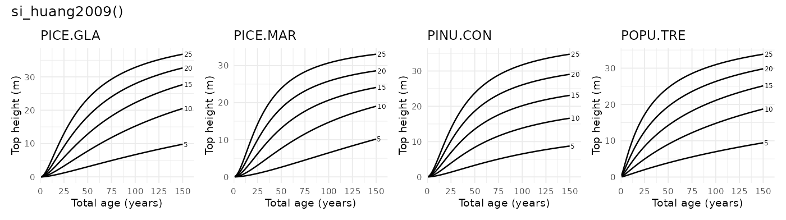

### `si_hugarcia2009()`

- Function reference:
  [`si_hugarcia2009()`](https://ptompalski.github.io/CanadaForestAllometry/reference/si_hugarcia2009.md)
- Description: Hu and Garcia (2009) interior spruce height-growth and
  site-index model (BC SBS zone)
- Age type: Breast-height age
- Coverage: BC
- Species coverage: PICE.ENG, PICE.GLA

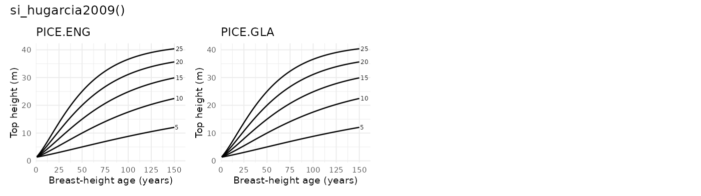

### `si_kerbowling1991()`

- Function reference:
  [`si_kerbowling1991()`](https://ptompalski.github.io/CanadaForestAllometry/reference/si_kerbowling1991.md)
- Description: New Brunswick polymorphic site-index model for softwoods
- Age type: Breast-height age
- Coverage: NB
- Species coverage: ABIE.BAL, PICE.GLA, PICE.MAR, PINU.BAN

### `si_lafleche2013()`

- Function reference:
  [`si_lafleche2013()`](https://ptompalski.github.io/CanadaForestAllometry/reference/si_lafleche2013.md)
- Description: Lafleche et al. (2013) Quebec ecological-site
  potential-height IQS curves
- Age type: Breast-height age
- Coverage: QC
- Species coverage: ABIE.BAL, BETU.PAP, PICE.GLA, PICE.MAR, PICE.RUB,
  PINU.BAN, PINU.STR, POPU.GRA, POPU.TRE, THUJ.OCC

This model uses fixed ecological-site curves rather than arbitrary
site-index levels. The figure below shows selected example combinations
of species and ecological keys for the potential curve set.

### `si_lundgrendolid1970()`

- Function reference:
  [`si_lundgrendolid1970()`](https://ptompalski.github.io/CanadaForestAllometry/reference/si_lundgrendolid1970.md)
- Description: Lundgren and Dolid model (exponential monomolecular form)
- Age type: Breast-height age
- Coverage: ON
- Species coverage: ABIE.BAL, BETU.PAP, LARI.LAR, PICE.GLA, PICE.MAR,
  PINU.BAN, PINU.RES, PINU.STR, POPU.TRE, QUER.RUB, THUJ.OCC

### `si_nigh1997()`

- Function reference:
  [`si_nigh1997()`](https://ptompalski.github.io/CanadaForestAllometry/reference/si_nigh1997.md)
- Description: Nigh (1997) logistic height-age (site index) model for
  Sitka spruce in coastal British Columbia
- Age type: Breast-height age
- Coverage: BC
- Species coverage: PICE.SIT

### `si_nigh1998()`

- Function reference:
  [`si_nigh1998()`](https://ptompalski.github.io/CanadaForestAllometry/reference/si_nigh1998.md)
- Description: Nigh (1998) log-logistic height-age (site index) model
  for western hemlock in the interior of British Columbia
- Age type: Breast-height age
- Coverage: BC
- Species coverage: TSUG.HET

### `si_nigh1998_gi()`

- Function reference:
  [`si_nigh1998_gi()`](https://ptompalski.github.io/CanadaForestAllometry/reference/si_nigh1998_gi.md)
- Description: Nigh (1998) growth-intercept site-index model for western
  hemlock in the interior of British Columbia
- Age type: Breast-height age
- Coverage: BC
- Species coverage: TSUG.HET

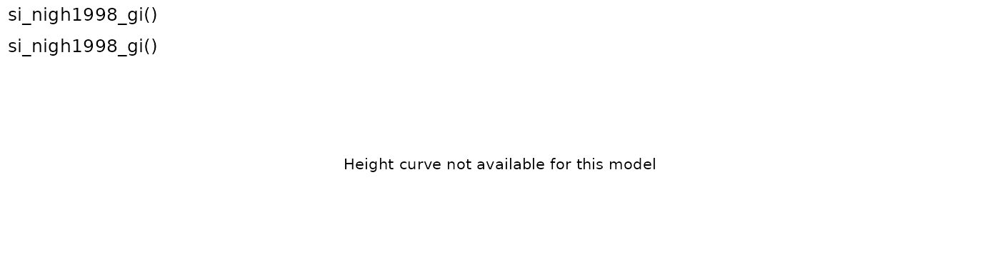

### `si_nigh2000()`

- Function reference:
  [`si_nigh2000()`](https://ptompalski.github.io/CanadaForestAllometry/reference/si_nigh2000.md)
- Description: Nigh (2000) polymorphic site-index model for interior
  western redcedar
- Age type: Breast-height age
- Coverage: BC
- Species coverage: THUJ.PLI

### `si_nigh2000_gi()`

- Function reference:
  [`si_nigh2000_gi()`](https://ptompalski.github.io/CanadaForestAllometry/reference/si_nigh2000_gi.md)
- Description: Nigh (2000) growth-intercept site-index model for
  interior western redcedar
- Age type: Breast-height age
- Coverage: BC
- Species coverage: THUJ.PLI

*No curve graphic shown for growth-intercept model.*

### `si_nigh2002()`

- Function reference:
  [`si_nigh2002()`](https://ptompalski.github.io/CanadaForestAllometry/reference/si_nigh2002.md)
- Description: Nigh et al. (2002) trembling aspen height-age (site
  index) model for British Columbia
- Age type: Breast-height age
- Coverage: BC
- Species coverage: POPU.TRE

### `si_nigh2004()`

- Function reference:
  [`si_nigh2004()`](https://ptompalski.github.io/CanadaForestAllometry/reference/si_nigh2004.md)
- Description: Nigh (2004) juvenile height-age (site index) model for
  lodgepole pine and interior spruce in British Columbia (province-wide
  and biogeoclimatic-zone parameter sets)
- Age type: Total age
- Coverage: BC
- Species coverage: PICE.GLA, PINU.CON

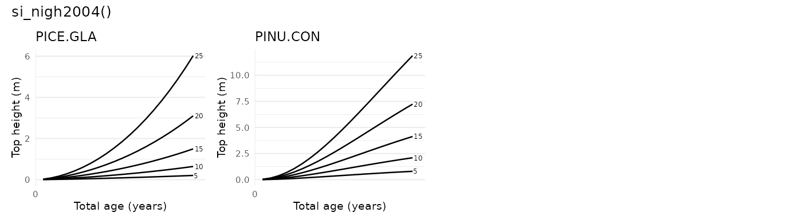

### `si_nigh2009()`

- Function reference:
  [`si_nigh2009()`](https://ptompalski.github.io/CanadaForestAllometry/reference/si_nigh2009.md)
- Description: Nigh et al. (2009) paper birch log-logistic height-age
  (site index) model for British Columbia (base, operational, and zonal
  variants)
- Age type: Breast-height age
- Coverage: BC
- Species coverage: BETU.PAP

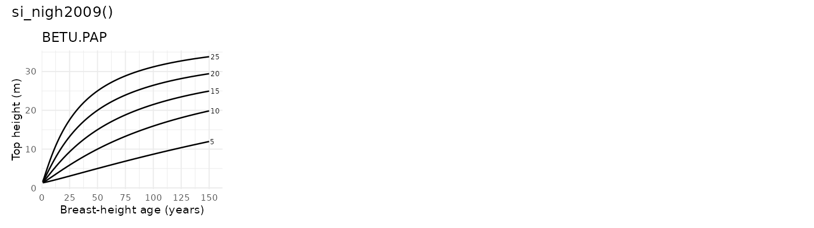

### `si_nigh2017()`

- Function reference:
  [`si_nigh2017()`](https://ptompalski.github.io/CanadaForestAllometry/reference/si_nigh2017.md)
- Description: Nigh (2017) grounded-GADA (Chapman-Richards) height-age
  (site index) model for lodgepole pine in British Columbia
- Age type: Breast-height age
- Coverage: BC
- Species coverage: PINU.CON

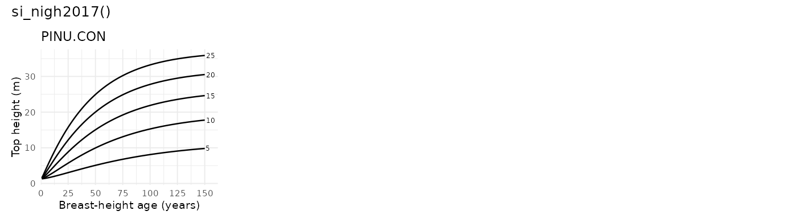

### `si_nighcourtin1998()`

- Function reference:
  [`si_nighcourtin1998()`](https://ptompalski.github.io/CanadaForestAllometry/reference/si_nighcourtin1998.md)
- Description: Nigh and Courtin (1998) red alder model, SI25 scale
- Age type: Breast-height age
- Coverage: BC
- Species coverage: ALNU.RUB

### `si_parresolvissage1998()`

- Function reference:
  [`si_parresolvissage1998()`](https://ptompalski.github.io/CanadaForestAllometry/reference/si_parresolvissage1998.md)
- Description: Parresol and Vissage (1998) base-age invariant eastern
  white pine model
- Age type: Breast-height age
- Coverage: NB, NL, NS, ON, PE, QC
- Species coverage: PINU.STR

### `si_payandeh1974()`

- Function reference:
  [`si_payandeh1974()`](https://ptompalski.github.io/CanadaForestAllometry/reference/si_payandeh1974.md)
- Description: Payandeh (1974) nonlinear site-index equations
- Age type: Breast-height age
- Coverage: Canada (all provinces/territories)
- Species coverage: ABIE.BAL, PICE.GLA, PICE.RUB, PICE.SIT, PINU.CON,
  PINU.MON, PINU.PON, PSEU.MEN, TSUG.HET

### `si_pregent2010()`

- Function reference:
  [`si_pregent2010()`](https://ptompalski.github.io/CanadaForestAllometry/reference/si_pregent2010.md)
- Description: Pregent et al. (2010) white spruce plantation site-index
  model
- Age type: Breast-height age
- Coverage: QC
- Species coverage: PICE.GLA

### `si_pregent2016()`

- Function reference:
  [`si_pregent2016()`](https://ptompalski.github.io/CanadaForestAllometry/reference/si_pregent2016.md)
- Description: Pregent et al. (2016) Norway spruce plantation site-index
  model
- Age type: Breast-height age
- Coverage: QC
- Species coverage: PICE.ABI

### `si_scottvoorhis1986()`

- Function reference:
  [`si_scottvoorhis1986()`](https://ptompalski.github.io/CanadaForestAllometry/reference/si_scottvoorhis1986.md)
- Description: Scott and Voorhis (1986) model using breast-height age
  directly
- Age type: Breast-height age
- Coverage: NB, NL, NS, ON, PE, QC
- Species coverage: ABIE.BAL, ACER.SAH, BETU.ALL, BETU.PAP, FRAX.AME,
  LIQU.STY, LIRI.TUL, PICE.GLA, PICE.MAR, PICE.RUB, PINU.BAN, PINU.ECH,
  PINU.RES, PINU.STR, PINU.TAE, PINU.VIR, POPU.GRA, QUER.ALB, THUJ.OCC

### `si_sharma2015()`

- Function reference:
  [`si_sharma2015()`](https://ptompalski.github.io/CanadaForestAllometry/reference/si_sharma2015.md)
- Description: Sharma et al. (2015) no-climate plantation model for jack
  pine and black spruce
- Age type: Breast-height age
- Coverage: ON
- Species coverage: PICE.MAR, PINU.BAN

### `si_sharma2021()`

- Function reference:
  [`si_sharma2021()`](https://ptompalski.github.io/CanadaForestAllometry/reference/si_sharma2021.md)
- Description: Sharma (2021) fixed-effects no-climate mixed-stand
  site-index model
- Age type: Breast-height age
- Coverage: ON
- Species coverage: PICE.MAR, PINU.BAN

### `si_sharma2022()`

- Function reference:
  [`si_sharma2022()`](https://ptompalski.github.io/CanadaForestAllometry/reference/si_sharma2022.md)
- Description: Sharma (2022) fixed-effects no-climate mixed-stand
  site-index model
- Age type: Breast-height age
- Coverage: ON
- Species coverage: PICE.MAR, POPU.TRE

### `si_sharmaparton2018a()`

- Function reference:
  [`si_sharmaparton2018a()`](https://ptompalski.github.io/CanadaForestAllometry/reference/si_sharmaparton2018a.md)
- Description: Sharma and Parton (2018) non-climate white spruce
  plantation model
- Age type: Breast-height age
- Coverage: ON
- Species coverage: PICE.GLA

### `si_sharmaparton2018b()`

- Function reference:
  [`si_sharmaparton2018b()`](https://ptompalski.github.io/CanadaForestAllometry/reference/si_sharmaparton2018b.md)
- Description: Sharma and Parton (2018) non-climate red pine plantation
  model
- Age type: Breast-height age
- Coverage: ON
- Species coverage: PINU.RES

### `si_sharmaparton2019()`

- Function reference:
  [`si_sharmaparton2019()`](https://ptompalski.github.io/CanadaForestAllometry/reference/si_sharmaparton2019.md)
- Description: Sharma and Parton (2019) non-climate white pine
  plantation model
- Age type: Breast-height age
- Coverage: ON
- Species coverage: PINU.STR

### `si_sharmareid2018()`

- Function reference:
  [`si_sharmareid2018()`](https://ptompalski.github.io/CanadaForestAllometry/reference/si_sharmareid2018.md)
- Description: Sharma and Reid (2018) fixed-effects natural-stand
  site-index model
- Age type: Breast-height age
- Coverage: ON
- Species coverage: PICE.MAR, PINU.BAN

### `si_thrower1994()`

- Function reference:
  [`si_thrower1994()`](https://ptompalski.github.io/CanadaForestAllometry/reference/si_thrower1994.md)
- Description: Thrower et al. (1994) BC interior species model set
- Age type: Breast-height age
- Coverage: BC
- Species coverage: ABIE.LAS, BETU.PAP, LARI.OCC, PICE.GLA, PINU.CON,
  PINU.MON, PINU.PON, POPU.TRE, PSEU.MEN, THUJ.PLI, TSUG.HET

## References
