# Site Index Models

## Site index models included in the package

### `si_alemdag1991()`

- Function reference:
  [`si_alemdag1991()`](https://ptompalski.github.io/CanadaForestAllometry/reference/si_alemdag1991.md)
- Description: Alemdag (1991) national (Canada-wide) modified
  Chapman-Richards site-index and height-growth model for white spruce
  in natural stands Alemdag ([1991](#ref-Alemdag1991))
- Age type: Breast-height age
- Coverage: Canada (all provinces/territories)
- Species coverage: PICE.GLA

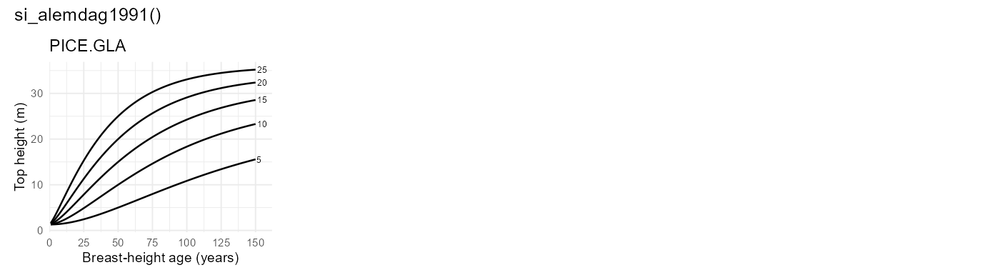

### `si_augerward2021()`

- Function reference:
  [`si_augerward2021()`](https://ptompalski.github.io/CanadaForestAllometry/reference/si_augerward2021.md)
- Description: Auger and Ward (2021) Quebec plantation site-index model
  Auger and Ward ([2021](#ref-AugerWard2021))
- Age type: Total age
- Coverage: QC
- Species coverage: PICE.MAR, PINU.BAN

### `si_batho2014()`

- Function reference:
  [`si_batho2014()`](https://ptompalski.github.io/CanadaForestAllometry/reference/si_batho2014.md)
- Description: Batho and Garcia (2014) polymorphic Bertalanffy-Richards
  height-age (site index) model for lodgepole pine in the Sub-Boreal
  Spruce zone of British Columbia Batho and García
  ([2014](#ref-Batho2014))
- Age type: Breast-height age
- Coverage: BC
- Species coverage: PINU.CON

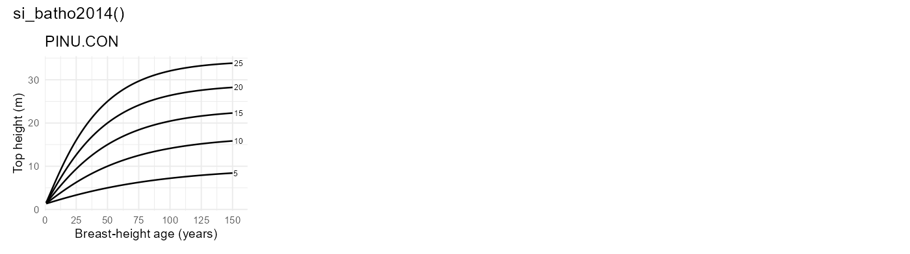

### `si_brisco2002()`

- Function reference:
  [`si_brisco2002()`](https://ptompalski.github.io/CanadaForestAllometry/reference/si_brisco2002.md)
- Description: Brisco, Klinka and Nigh (2002) Chapman-Richards
  height-age (site index) model for western larch in British Columbia
  Brisco et al. ([2002](#ref-Brisco2002))
- Age type: Breast-height age
- Coverage: BC
- Species coverage: LARI.OCC

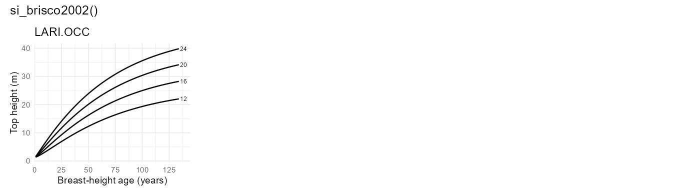

### `si_buckman2006()`

- Function reference:
  [`si_buckman2006()`](https://ptompalski.github.io/CanadaForestAllometry/reference/si_buckman2006.md)
- Description: Buckman et al. (2006) piecewise red pine site-index model
  Buckmann et al. ([2006](#ref-Buckman2006))
- Age type: Total age
- Coverage: ON
- Species coverage: PINU.RES

### `si_carmean1989()`

- Function reference:
  [`si_carmean1989()`](https://ptompalski.github.io/CanadaForestAllometry/reference/si_carmean1989.md)
- Description: Carmean et al. (1989) eastern species site-index model
  set Carmean et al. ([1989](#ref-Carmean1989))
- Age type: Total age
- Coverage: NB, NL, NS, ON, PE, QC
- Species coverage: ACER.SAH, BETU.ALL, CHAM.THY, FAGU.GRA, FRAX.AME,
  FRAX.NIG, PRUN.SER, QUER.RUB, TILI.AME, TSUG.CAN, ULMU.AME

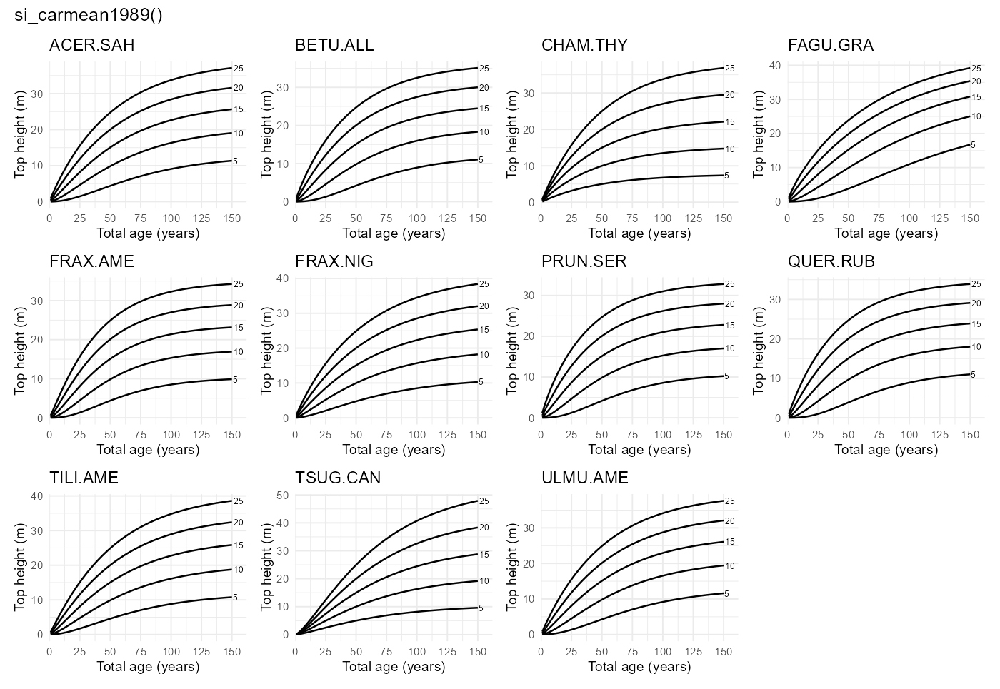

### `si_carmean1996()`

- Function reference:
  [`si_carmean1996()`](https://ptompalski.github.io/CanadaForestAllometry/reference/si_carmean1996.md)
- Description: Carmean (1996) northwest Ontario site-index model set
  Carmean ([1996](#ref-Carmean1996))
- Age type: Breast-height age
- Coverage: ON
- Species coverage: ABIE.BAL, BETU.PAP, LARI.LAR, PICE.GLA, PICE.MAR,
  PINU.BAN, POPU.TRE

### `si_carmean2001()`

- Function reference:
  [`si_carmean2001()`](https://ptompalski.github.io/CanadaForestAllometry/reference/si_carmean2001.md)
- Description: Carmean, Niznowski and Hazenberg (2001) polymorphic
  (Newnham) site-index model for jack pine in northern Ontario Carmean
  et al. ([2001](#ref-Carmean2001))
- Age type: Breast-height age
- Coverage: ON
- Species coverage: PINU.BAN

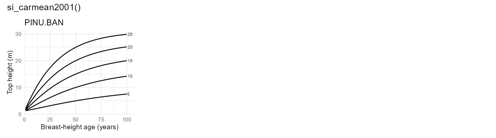

### `si_carmean2006()`

- Function reference:
  [`si_carmean2006()`](https://ptompalski.github.io/CanadaForestAllometry/reference/si_carmean2006.md)
- Description: Carmean, Hazenberg and Deschamps (2006) polymorphic
  (Newnham) site-index model for black spruce and trembling aspen in
  northwest Ontario Carmean et al. ([2006](#ref-Carmean2006))
- Age type: Breast-height age
- Coverage: ON
- Species coverage: PICE.MAR, POPU.TRE

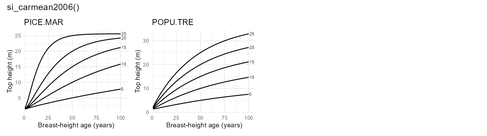

### `si_carmeanhahn1981()`

- Function reference:
  [`si_carmeanhahn1981()`](https://ptompalski.github.io/CanadaForestAllometry/reference/si_carmeanhahn1981.md)
- Description: Lake States site-index model for balsam fir and white
  spruce Carmean and Hahn ([1981](#ref-CarmeanHahn1981))
- Age type: Total age
- Coverage: ON
- Species coverage: ABIE.BAL, PICE.GLA

### `si_chenklinka2000()`

- Function reference:
  [`si_chenklinka2000()`](https://ptompalski.github.io/CanadaForestAllometry/reference/si_chenklinka2000.md)
- Description: Chen and Klinka (2000) conditioned Chapman-Richards
  height-age (site index) model for subalpine fir, Engelmann spruce, and
  lodgepole pine in the ESSF zone of British Columbia Chen and Klinka
  ([2000](#ref-ChenKlinka2000))
- Age type: Breast-height age
- Coverage: BC
- Species coverage: ABIE.LAS, PICE.ENG, PINU.CON

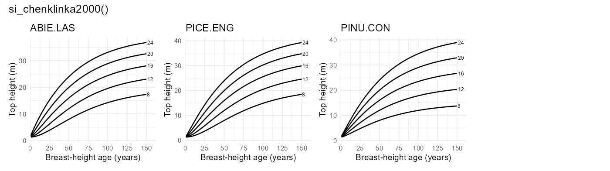

### `si_cieszewski1993()`

- Function reference:
  [`si_cieszewski1993()`](https://ptompalski.github.io/CanadaForestAllometry/reference/si_cieszewski1993.md)
- Description: Cieszewski, Bella and Yeung (1993) preliminary
  variable-age site-index model for eleven Saskatchewan species
  Cieszewski et al. ([1993](#ref-Cieszewski1993))
- Age type: Breast-height age
- Coverage: SK
- Species coverage: ABIE.BAL, ACER.NEG, BETU.PAP, LARI.LAR, PICE.GLA,
  PICE.MAR, PINU.BAN, PINU.CON, POPU.BAL, POPU.TRE, ULMU.AME

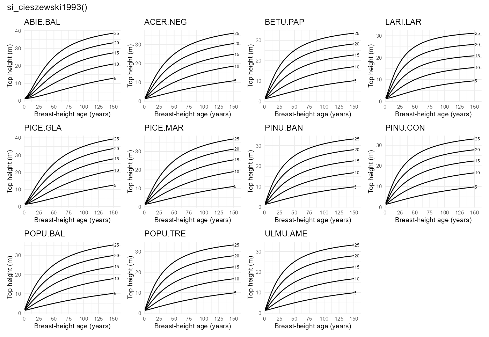

### `si_cieszewskibella1991()`

- Function reference:
  [`si_cieszewskibella1991()`](https://ptompalski.github.io/CanadaForestAllometry/reference/si_cieszewskibella1991.md)
- Description: Alberta polymorphic variable-age site-index model for
  four major tree species Cieszewski and Bella
  ([1991](#ref-CieszewskiBella1991))
- Age type: Breast-height age
- Coverage: AB
- Species coverage: PICE.GLA, PICE.MAR, PINU.CON, POPU.TRE

### `si_goelz1992()`

- Function reference:
  [`si_goelz1992()`](https://ptompalski.github.io/CanadaForestAllometry/reference/si_goelz1992.md)
- Description: Goelz and Burk (1992) base-age invariant Chapman-Richards
  site-index model for jack pine in north central Ontario Goelz and Burk
  ([1992](#ref-Goelz1992))
- Age type: Breast-height age
- Coverage: ON
- Species coverage: PINU.BAN

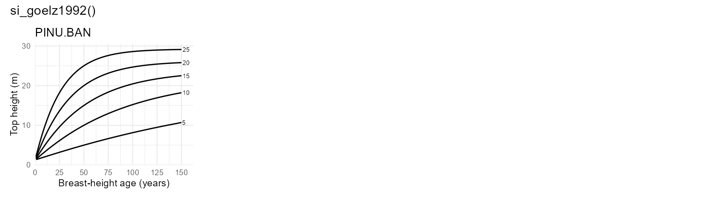

### `si_goudie1984()`

- Function reference:
  [`si_goudie1984()`](https://ptompalski.github.io/CanadaForestAllometry/reference/si_goudie1984.md)
- Description: Goudie (1984) logistic height-age (site-index) model for
  lodgepole pine and white spruce in British Columbia (SAS-reference
  implementation; pine dry-site coefficients) Goudie
  ([1984](#ref-Goudie1984))
- Age type: Breast-height age
- Coverage: BC
- Species coverage: PICE.GLA, PINU.CON

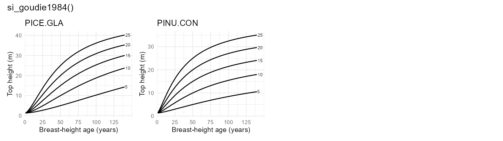

### `si_huang1994()`

- Function reference:
  [`si_huang1994()`](https://ptompalski.github.io/CanadaForestAllometry/reference/si_huang1994.md)
- Description: Huang et al. (1994) Alberta polymorphic site-index model
  set Huang et al. ([1994](#ref-Huang1994si))
- Age type: Breast-height age
- Coverage: AB
- Species coverage: ABIE.BAL, PICE.GLA, PICE.MAR, PINU.BAN, PINU.CON,
  POPU.BAL, POPU.TRE, PSEU.MEN

### `si_huang2009()`

- Function reference:
  [`si_huang2009()`](https://ptompalski.github.io/CanadaForestAllometry/reference/si_huang2009.md)
- Description: Huang, Meng and Yang (2009) GYPSY top-height / site-index
  model for four Alberta tree species (site index at 50 years
  breast-height age) Huang et al. ([2009](#ref-Huang2009gypsy))
- Age type: Total age
- Coverage: AB
- Species coverage: PICE.GLA, PICE.MAR, PINU.CON, POPU.TRE

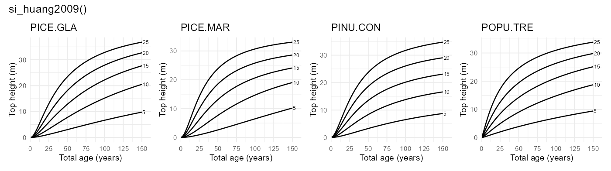

### `si_hugarcia2009()`

- Function reference:
  [`si_hugarcia2009()`](https://ptompalski.github.io/CanadaForestAllometry/reference/si_hugarcia2009.md)
- Description: Hu and Garcia (2009) interior spruce height-growth and
  site-index model (BC SBS zone) Hu and García
  ([2010](#ref-HuGarcia2009))
- Age type: Breast-height age
- Coverage: BC
- Species coverage: PICE.ENG, PICE.GLA

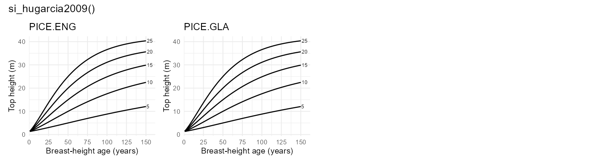

### `si_kerbowling1991()`

- Function reference:
  [`si_kerbowling1991()`](https://ptompalski.github.io/CanadaForestAllometry/reference/si_kerbowling1991.md)
- Description: New Brunswick polymorphic site-index model for softwoods
  Ker and Bowling ([1991](#ref-KerBowling1991))
- Age type: Breast-height age
- Coverage: NB
- Species coverage: ABIE.BAL, PICE.GLA, PICE.MAR, PINU.BAN

### `si_lafleche2013()`

- Function reference:
  [`si_lafleche2013()`](https://ptompalski.github.io/CanadaForestAllometry/reference/si_lafleche2013.md)
- Description: Lafleche et al. (2013) Quebec ecological-site
  potential-height IQS curves Lafleche et al.
  ([2013](#ref-LaflecheEtAl2013))
- Age type: Breast-height age
- Coverage: QC
- Species coverage: ABIE.BAL, BETU.PAP, PICE.GLA, PICE.MAR, PICE.RUB,
  PINU.BAN, PINU.STR, POPU.GRA, POPU.TRE, THUJ.OCC

This model uses fixed ecological-site curves rather than arbitrary
site-index levels. The figure below shows selected example combinations
of species and ecological keys for the potential curve set.

### `si_lundgrendolid1970()`

- Function reference:
  [`si_lundgrendolid1970()`](https://ptompalski.github.io/CanadaForestAllometry/reference/si_lundgrendolid1970.md)
- Description: Lundgren and Dolid model (exponential monomolecular form)
  Lundgren and Dolid ([1970](#ref-LundgrenDolid1970))
- Age type: Breast-height age
- Coverage: ON
- Species coverage: ABIE.BAL, BETU.PAP, LARI.LAR, PICE.GLA, PICE.MAR,
  PINU.BAN, PINU.RES, PINU.STR, POPU.TRE, QUER.RUB, THUJ.OCC

### `si_nigh1997()`

- Function reference:
  [`si_nigh1997()`](https://ptompalski.github.io/CanadaForestAllometry/reference/si_nigh1997.md)
- Description: Nigh (1997) logistic height-age (site index) model for
  Sitka spruce in coastal British Columbia Nigh ([1997](#ref-Nigh1997))
- Age type: Breast-height age
- Coverage: BC
- Species coverage: PICE.SIT

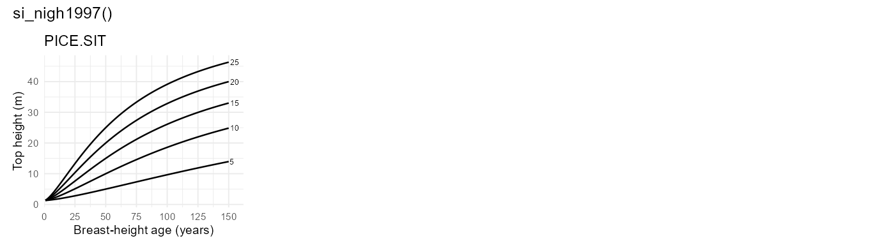

### `si_nigh1998()`

- Function reference:
  [`si_nigh1998()`](https://ptompalski.github.io/CanadaForestAllometry/reference/si_nigh1998.md)
- Description: Nigh (1998) log-logistic height-age (site index) model
  for western hemlock in the interior of British Columbia Nigh
  ([1998](#ref-Nigh1998))
- Age type: Breast-height age
- Coverage: BC
- Species coverage: TSUG.HET

### `si_nigh1998_gi()`

- Function reference:
  [`si_nigh1998_gi()`](https://ptompalski.github.io/CanadaForestAllometry/reference/si_nigh1998_gi.md)
- Description: Nigh (1998) growth-intercept site-index model for western
  hemlock in the interior of British Columbia Nigh
  ([1998](#ref-Nigh1998))
- Age type: Breast-height age
- Coverage: BC
- Species coverage: TSUG.HET

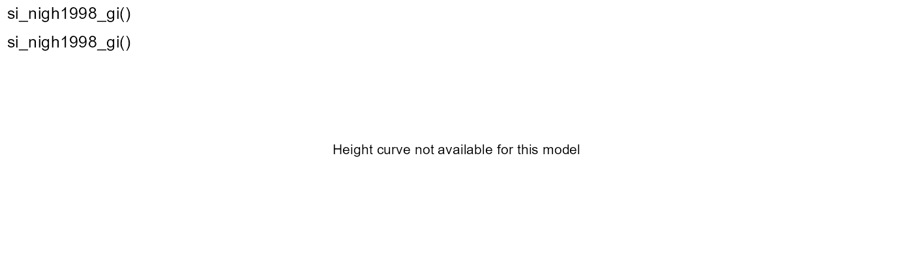

### `si_nigh2000()`

- Function reference:
  [`si_nigh2000()`](https://ptompalski.github.io/CanadaForestAllometry/reference/si_nigh2000.md)
- Description: Nigh (2000) polymorphic site-index model for interior
  western redcedar Nigh ([2000](#ref-Nigh2000))
- Age type: Breast-height age
- Coverage: BC
- Species coverage: THUJ.PLI

### `si_nigh2000_gi()`

- Function reference:
  [`si_nigh2000_gi()`](https://ptompalski.github.io/CanadaForestAllometry/reference/si_nigh2000_gi.md)
- Description: Nigh (2000) growth-intercept site-index model for
  interior western redcedar Nigh ([2000](#ref-Nigh2000))
- Age type: Breast-height age
- Coverage: BC
- Species coverage: THUJ.PLI

*No curve graphic shown for growth-intercept model.*

### `si_nigh2002()`

- Function reference:
  [`si_nigh2002()`](https://ptompalski.github.io/CanadaForestAllometry/reference/si_nigh2002.md)
- Description: Nigh et al. (2002) trembling aspen height-age (site
  index) model for British Columbia Nigh et al. ([2002](#ref-Nigh2002))
- Age type: Breast-height age
- Coverage: BC
- Species coverage: POPU.TRE

### `si_nigh2004()`

- Function reference:
  [`si_nigh2004()`](https://ptompalski.github.io/CanadaForestAllometry/reference/si_nigh2004.md)
- Description: Nigh (2004) juvenile height-age (site index) model for
  lodgepole pine and interior spruce in British Columbia (province-wide
  and biogeoclimatic-zone parameter sets) Nigh ([2004](#ref-Nigh2004))
- Age type: Total age
- Coverage: BC
- Species coverage: PICE.GLA, PINU.CON

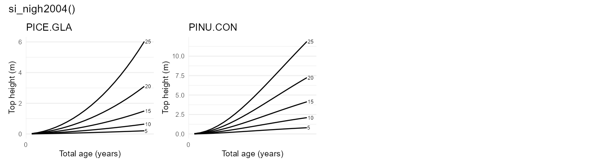

### `si_nigh2009()`

- Function reference:
  [`si_nigh2009()`](https://ptompalski.github.io/CanadaForestAllometry/reference/si_nigh2009.md)
- Description: Nigh et al. (2009) paper birch log-logistic height-age
  (site index) model for British Columbia (base, operational, and zonal
  variants) Nigh et al. ([2009](#ref-Nigh2009))
- Age type: Breast-height age
- Coverage: BC
- Species coverage: BETU.PAP

### `si_nigh2017()`

- Function reference:
  [`si_nigh2017()`](https://ptompalski.github.io/CanadaForestAllometry/reference/si_nigh2017.md)
- Description: Nigh (2017) grounded-GADA (Chapman-Richards) height-age
  (site index) model for lodgepole pine in British Columbia Nigh
  ([2017](#ref-Nigh2017))
- Age type: Breast-height age
- Coverage: BC
- Species coverage: PINU.CON

### `si_nighcourtin1998()`

- Function reference:
  [`si_nighcourtin1998()`](https://ptompalski.github.io/CanadaForestAllometry/reference/si_nighcourtin1998.md)
- Description: Nigh and Courtin (1998) red alder model, SI25 scale Nigh
  and Courtin ([1998](#ref-NighCourtin1998))
- Age type: Breast-height age
- Coverage: BC
- Species coverage: ALNU.RUB

### `si_parresolvissage1998()`

- Function reference:
  [`si_parresolvissage1998()`](https://ptompalski.github.io/CanadaForestAllometry/reference/si_parresolvissage1998.md)
- Description: Parresol and Vissage (1998) base-age invariant eastern
  white pine model Parresol and Vissage
  ([1998](#ref-ParresolVissage1998))
- Age type: Breast-height age
- Coverage: NB, NL, NS, ON, PE, QC
- Species coverage: PINU.STR

### `si_payandeh1974()`

- Function reference:
  [`si_payandeh1974()`](https://ptompalski.github.io/CanadaForestAllometry/reference/si_payandeh1974.md)
- Description: Payandeh (1974) nonlinear site-index equations Payandeh
  ([1974](#ref-Payandeh1974))
- Age type: Breast-height age
- Coverage: Canada (all provinces/territories)
- Species coverage: ABIE.BAL, PICE.GLA, PICE.RUB, PICE.SIT, PINU.CON,
  PINU.MON, PINU.PON, PSEU.MEN, TSUG.HET

### `si_pregent2010()`

- Function reference:
  [`si_pregent2010()`](https://ptompalski.github.io/CanadaForestAllometry/reference/si_pregent2010.md)
- Description: Pregent et al. (2010) white spruce plantation site-index
  model Pregent et al. ([2010](#ref-Pregent2010))
- Age type: Breast-height age
- Coverage: QC
- Species coverage: PICE.GLA

### `si_pregent2016()`

- Function reference:
  [`si_pregent2016()`](https://ptompalski.github.io/CanadaForestAllometry/reference/si_pregent2016.md)
- Description: Pregent et al. (2016) Norway spruce plantation site-index
  model Pregent and Auger ([2016](#ref-Pregent2016))
- Age type: Breast-height age
- Coverage: QC
- Species coverage: PICE.ABI

### `si_scottvoorhis1986()`

- Function reference:
  [`si_scottvoorhis1986()`](https://ptompalski.github.io/CanadaForestAllometry/reference/si_scottvoorhis1986.md)
- Description: Scott and Voorhis (1986) model using breast-height age
  directly Scott and Voorhis ([1986](#ref-ScottVoorhis1986))
- Age type: Breast-height age
- Coverage: NB, NL, NS, ON, PE, QC
- Species coverage: ABIE.BAL, ACER.SAH, BETU.ALL, BETU.PAP, FRAX.AME,
  LIQU.STY, LIRI.TUL, PICE.GLA, PICE.MAR, PICE.RUB, PINU.BAN, PINU.ECH,
  PINU.RES, PINU.STR, PINU.TAE, PINU.VIR, POPU.GRA, QUER.ALB, THUJ.OCC

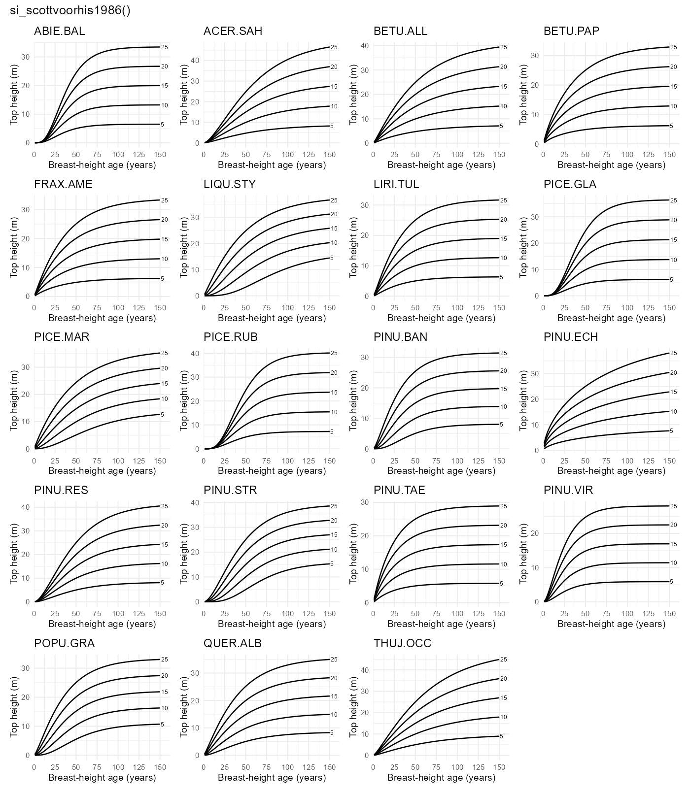

### `si_sharma2015()`

- Function reference:
  [`si_sharma2015()`](https://ptompalski.github.io/CanadaForestAllometry/reference/si_sharma2015.md)
- Description: Sharma et al. (2015) no-climate plantation model for jack
  pine and black spruce Sharma et al. ([2015](#ref-SharmaEtAl2015))
- Age type: Breast-height age
- Coverage: ON
- Species coverage: PICE.MAR, PINU.BAN

### `si_sharma2021()`

- Function reference:
  [`si_sharma2021()`](https://ptompalski.github.io/CanadaForestAllometry/reference/si_sharma2021.md)
- Description: Sharma (2021) fixed-effects no-climate mixed-stand
  site-index model Sharma ([2021](#ref-Sharma2021SI))
- Age type: Breast-height age
- Coverage: ON
- Species coverage: PICE.MAR, PINU.BAN

### `si_sharma2022()`

- Function reference:
  [`si_sharma2022()`](https://ptompalski.github.io/CanadaForestAllometry/reference/si_sharma2022.md)
- Description: Sharma (2022) fixed-effects no-climate mixed-stand
  site-index model Sharma ([2022](#ref-Sharma2022))
- Age type: Breast-height age
- Coverage: ON
- Species coverage: PICE.MAR, POPU.TRE

### `si_sharmaparton2018a()`

- Function reference:
  [`si_sharmaparton2018a()`](https://ptompalski.github.io/CanadaForestAllometry/reference/si_sharmaparton2018a.md)
- Description: Sharma and Parton (2018) non-climate white spruce
  plantation model Sharma and Parton ([2018a](#ref-SharmaParton2018a))
- Age type: Breast-height age
- Coverage: ON
- Species coverage: PICE.GLA

### `si_sharmaparton2018b()`

- Function reference:
  [`si_sharmaparton2018b()`](https://ptompalski.github.io/CanadaForestAllometry/reference/si_sharmaparton2018b.md)
- Description: Sharma and Parton (2018) non-climate red pine plantation
  model Sharma and Parton ([2018b](#ref-SharmaParton2018b))
- Age type: Breast-height age
- Coverage: ON
- Species coverage: PINU.RES

### `si_sharmaparton2019()`

- Function reference:
  [`si_sharmaparton2019()`](https://ptompalski.github.io/CanadaForestAllometry/reference/si_sharmaparton2019.md)
- Description: Sharma and Parton (2019) non-climate white pine
  plantation model Sharma and Parton ([2019](#ref-SharmaParton2019))
- Age type: Breast-height age
- Coverage: ON
- Species coverage: PINU.STR

### `si_sharmareid2018()`

- Function reference:
  [`si_sharmareid2018()`](https://ptompalski.github.io/CanadaForestAllometry/reference/si_sharmareid2018.md)
- Description: Sharma and Reid (2018) fixed-effects natural-stand
  site-index model Sharma and Reid ([2018](#ref-SharmaReid2018))
- Age type: Breast-height age
- Coverage: ON
- Species coverage: PICE.MAR, PINU.BAN

### `si_thrower1994()`

- Function reference:
  [`si_thrower1994()`](https://ptompalski.github.io/CanadaForestAllometry/reference/si_thrower1994.md)
- Description: Thrower et al. (1994) BC interior species model set
  Thrower et al. ([1994](#ref-Thrower1994))
- Age type: Breast-height age
- Coverage: BC
- Species coverage: ABIE.LAS, BETU.PAP, LARI.OCC, PICE.GLA, PINU.CON,
  PINU.MON, PINU.PON, POPU.TRE, PSEU.MEN, THUJ.PLI, TSUG.HET

## References

Alemdag, I.S., 1991. National site-index and height-growth curves for
white spruce growing in natural stands in Canada. Canadian Journal of
Forest Research 21, 1466–1474. <https://doi.org/10.1139/x91-206>

Auger, I., Ward, C., 2021. Tables de rendement pour les plantations
d’epinette noire et les plantations de pin gris au quebec (No. SSS-06),
Avis technique. Gouvernement du Quebec, Quebec.

Batho, A., García, O., 2014. A site index model for lodgepole pine in
British Columbia. Forest Science 60, 982–987.
<https://doi.org/10.5849/forsci.13-509>

Brisco, D., Klinka, K., Nigh, G., 2002. Height growth models for western
larch in British Columbia. Western Journal of Applied Forestry 17,
66–74. <https://doi.org/10.1093/wjaf/17.2.66>

Buckmann, R.E., Bishaw, B., Hanson, T.J., Benford, F.A., 2006. Growth
and yield of red pine in the lake states (No. NC-271), General technical
report. U.S. Department of Agriculture, Forest Service.

Carmean, W.H., 1996. Site-quality evaluation, site-quality maintenance,
and site-specific management for forest land in northwest ontario (No.
TR-105), NWST technical report. Ontario Ministry of Natural Resources,
Northwest Science; Technology, Thunder Bay, Ontario.

Carmean, W.H., Hahn, J.T., 1981. Revised Site Index Curves for Balsam
Fir and White Spruce in the Lake States. Research Note NC-269. St. Paul,
MN: U.S. Dept. of Agriculture, Forest Service, North Central Forest
Experiment Station 269. <https://doi.org/10.2737/NC-RN-269>

Carmean, W.H., Hahn, J.T., Jacobs, R.D., 1989. Site index curves for
forest tree species in the eastern united states (No. NC-128), General
technical report. U.S. Department of Agriculture, Forest Service, North
Central Forest Experiment Station.

Carmean, W.H., Hazenberg, G., Deschamps, K.C., 2006. Polymorphic site
index curves for black spruce and trembling aspen in northwest Ontario.
The Forestry Chronicle 82, 213–231. <https://doi.org/10.5558/tfc82213-2>

Carmean, W.H., Niznowski, G.P., Hazenberg, G., 2001. Polymorphic site
index curves for jack pine in northern Ontario. The Forestry Chronicle
77, 141–150. <https://doi.org/10.5558/tfc77141-1>

Chen, H.Y.H., Klinka, K., 2000. Height growth models for high-elevation
subalpine fir, engelmann spruce, and lodgepole pine in british columbia.
Western Journal of Applied Forestry 15, 62–69.

Cieszewski, C.J., Bella, I.E., 1991. Polymorphic height and site index
curves for the major tree species in alberta (No. 51), Forest management
note. Forestry Canada, Northwest Region, Northern Forestry Centre,
Edmonton, Alberta.

Cieszewski, C.J., Bella, I.E., Yeung, D.P., 1993. Preliminary site-index
height growth curves for eleven timber species in Saskatchewan (Draft
unpublished project report). Natural Resources Canada, Canadian Forest
Service, Prince Albert, Saskatchewan.

Goelz, J.C.G., Burk, T.E., 1992. Development of a well-behaved site
index equation: Jack pine in north central Ontario. Canadian Journal of
Forest Research 22, 776–784. <https://doi.org/10.1139/x92-105>

Goudie, J.W., 1984. Height growth and site index curves for lodgepole
pine and white spruce and interim managed stand yield tables for
lodgepole pine in British Columbia (Final Report FY-1983-84). Research
Branch, British Columbia Ministry of Forests, Victoria, B.C.

Hu, Z., García, O., 2010. A height-growth and site-index model for
interior spruce in the Sub-Boreal Spruce biogeoclimatic zone of British
Columbia. Canadian Journal of Forest Research 40, 1175–1183.
<https://doi.org/10.1139/X10-076>

Huang, S., Meng, S.X., Yang, Y., 2009. A growth and yield projection
system (GYPSY) for natural and post-harvest stands in Alberta (No. Tech.
Rep. Pub. No. T/216). Forest Management Branch, Alberta Sustainable
Resource Development, Edmonton, Alberta.

Huang, S., Titus, S.J., Lakusta, T.W., 1994. Ecologically based site
index curves and tables for major Alberta tree species. Tech. Report No.
T307.

Ker, M.F., Bowling, C., 1991. Polymorphic site index equations for four
New Brunswick softwood species. Canadian Journal of Forest Research 21,
728–732. <https://doi.org/10.1139/x91-103>

Lafleche, V., Bernier, S., Saucier, J.-P., Gagne, C., 2013. Indices de
qualite de station des principales essences commerciales en fonction des
types ecologiques du quebec meridional. Ministere des Ressources
naturelles, Direction des inventaires forestiers, Quebec.

Lundgren, A.L., Dolid, W.A., 1970. Biological growth functions describe
published site index curves for Lake States timber species. Research
Paper NC-36. St. Paul, MN: U.S. Dept. of Agriculture, Forest Service,
North Central Forest Experiment Station 36.

Nigh, G.D., 2017. [Development of a lodgepole pine site index model with
the grounded-Generalized Algebraic Difference Approach
(g-GADA)](https://www.for.gov.bc.ca/hfd/pubs/Docs/Rr/Rr31.htm) (Research
Report No. 31). Province of British Columbia, Victoria, B.C.

Nigh, G.D., 2004. [Juvenile height models for lodgepole pine and
interior spruce: Validation of existing models and development of new
models](https://www.for.gov.bc.ca/hfd/pubs/Docs/Rr/Rr25.htm) (Research
Report No. 25). Province of British Columbia, Victoria, B.C.

Nigh, G.D., 2000. Western redcedar site index models for the interior of
British Columbia (No. Rep. 18). BC Ministry of Forests, Research Branch,
Victoria, B.C.

Nigh, G.D., 1998. A system for estimating height and site index of
western hemlock in the interior of British Columbia. The Forestry
Chronicle 74, 588–596.

Nigh, G.D., 1997. A Sitka spruce height-age model with improved
extrapolation properties. The Forestry Chronicle 73, 363–369.

Nigh, G.D., Courtin, P.J., 1998. Height models for Red Alder (Alnus
rubra Bong.) in British Columbia. New Forests 16, 59–70.
<https://doi.org/10.1023/A:1006561502635>

Nigh, G.D., Krestov, P.V., Klinka, K., 2002. Trembling aspen height-age
models for British Columbia. Northwest Science 76, 202–212.

Nigh, G.D., Thomas, K.D., Yearsley, K., Wang, J., 2009. Site-dependent
height-age models for paper birch in British Columbia. Northwest Science
83, 253–261. <https://doi.org/10.3955/046.083.0308>

Parresol, B.R., Vissage, J.S., 1998. White pine site index for the
southern forest survey (No. Research Paper SRS-10). U.S. Department of
Agriculture, Forest Service, Southern Research Station, Asheville, NC.

Payandeh, B., 1974. Nonlinear site index equations for several major
Canadian timber species. The Forestry Chronicle 50, 194–196.
<https://doi.org/10.5558/tfc50194-5>

Pregent, G., Auger, I., 2016. Tarif de cubage, tables de rendement et
modeles de croissance pour les plantations d’epinette de norvege au
quebec (No. 176), Memoire de recherche forestiere. Ministere des Forets,
de la Faune et des Parcs, Direction de la recherche forestiere, Quebec.

Pregent, G., Picher, G., Auger, I., 2010. Tarif de cubage, tables de
rendement et modeles de croissance pour les plantations d’epinette
blanche au quebec (No. 160), Memoire de recherche forestiere. Ministere
des Ressources naturelles et de la Faune, Direction de la recherche
forestiere, Quebec.

Scott, C.T., Voorhis, N.G., 1986. Northeastern Forest Survey Site Index
Equations and Site Productivity Classes. Northern Journal of Applied
Forestry 3, 144–148. <https://doi.org/10.1093/njaf/3.4.144>

Sharma, M., 2022. Climate effects on black spruce and trembling aspen
productivity in natural origin mixed stands. Forests 13, 430.
<https://doi.org/10.3390/f13030430>

Sharma, M., 2021. Climate effects on jack pine and black spruce
productivity in natural origin mixed stands and site index conversion
equations. Trees, Forests and People 5, 100089.
<https://doi.org/10.1016/j.tfp.2021.100089>

Sharma, M., Parton, J., 2019. Modelling the effects of climate on site
productivity of white pine plantations. Canadian Journal of Forest
Research 49, 1289–1297. <https://doi.org/10.1139/cjfr-2019-0165>

Sharma, M., Parton, J., 2018a. Analyzing and modelling effects of
climate on site productivity of white spruce plantations. The Forestry
Chronicle 94, 173–182.

Sharma, M., Parton, J., 2018b. Climatic effects on site productivity of
red pine plantations. Forest Science 64, 544–554.

Sharma, M., Reid, D.E.B., 2018. Stand height/site index equations for
jack pine and black spruce trees grown in natural stands. Forest Science
64, 33–40. <https://doi.org/10.5849/FS-2016-133>

Sharma, M., Subedi, N., Ter-Mikaelian, M., Parton, J., 2015. Modeling
climatic effects on stand height/site index of plantation-grown jack
pine and black spruce trees. Forest Science 61, 25–34.
<https://doi.org/10.5849/forsci.13-190>

Thrower, J.S., Nussbaum, A.F., Di Lucca, C.M., 1994. Site index curves
and tables for british columbia: Interior species (No. Field Guide
Insert 6), Land management handbook. B.C. Ministry of Forests.
